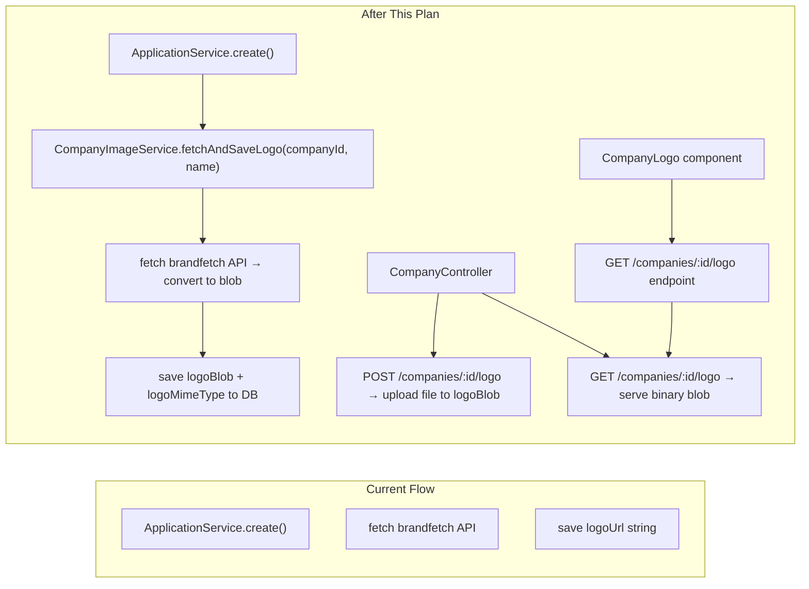

# Company Image Blob Storage Migration

> **Created:** 2025-07-09
> **Request:** "in company.service.ts instead of keep the image link, i would like to put inside my db the actual image at a blob and send it to the front end as the image link. so the front end can upload directly images instead of keep only a link. How i can do it properly ? in application.service.ts when we add a new company i want to move the fetch logic to a company-image.service.ts that will save images inside the db."
> **Status:** 🟡 Pending

---

## 1. What Exists Today

### Files involved

- `packages/db/src/entities/company.ts` — `Company` entity has `logoUrl: string` column (stores external CDN URL)
- `packages/db/src/dto/company/update-company.dto.ts` — `UpdateCompanyDto.logoUrl` accepts a string URL
- `packages/db/src/dto/company/create-company.dto.ts` — no logo field
- `packages/db/src/query/company.ts` — `CompanySearchResult` has `logoUrl?: string`
- `apps/api/src/company/company.service.ts` — `CompanyService` (no image logic)
- `apps/api/src/company/company.controller.ts` — `CompanyController` with CRUD + CSV import/export
- `apps/api/src/company/company.module.ts` — `CompanyModule` with `MulterModule` already configured (10MB limit)
- `apps/api/src/application/application.service.ts` — `ApplicationService.create()` auto-fetches logo from Brandfetch API when creating a new company
- `apps/api/src/application/application.module.ts` — imports `TypeOrmModule.forFeature([Application, Company])`
- `apps/web/src/components/shared/company-logo.tsx` — renders `<Image src={logoUrl}>` from an external URL
- `apps/web/src/components/features/companies/company-dialog/properties.tsx` — shows URL text input for `logoUrl`
- `apps/web/next.config.ts` — has `cdn.brandfetch.io` as a remote image pattern

### Current data flow

```
ApplicationService.create()
  → new company name → resolveCompanyLogoUrl(name)
    → fetch https://api.brandfetch.io/v2/search/{name}
    → returns https://cdn.brandfetch.io/{brandId}/fallback/404/icon.svg?
  → saves { name, logoUrl: "<brandfetch URL>", status: PENDING }
```

Logo URLs are external — the DB only holds the link.

---

## 2. What We Will Be Doing

Two major changes:

### A. Store image blob directly in DB

Replace `logoUrl` (string) with `logoBlob` (Buffer/bytea) + `logoMimeType` (string) in the Company entity. The API will serve images via a dedicated `GET /companies/:id/logo` endpoint that returns the binary blob with the correct `Content-Type`. Frontend uploads images via `POST /companies/:id/logo` with multipart form data.

### B. Extract brandfetch auto-fetch into a dedicated service

Remove `resolveCompanyLogoUrl` from `ApplicationService`. Create `CompanyImageService` that handles:
- Fetching from brandfetch
- Converting the SVG/PNG response to a blob
- Storing it in `Company.logoBlob`
- Serving the blob via a GET endpoint
- Handling direct file uploads

When `ApplicationService.create()` encounters a new company, it will call `CompanyImageService` to auto-fetch and store the logo before returning.

### Key decisions

- **Serving endpoint**: `GET /companies/:id/logo` returns the raw blob with correct Content-Type. If `logoBlob` is null, returns 404.
- **Upload endpoint**: `POST /companies/:id/logo` accepts a multipart file (image/png, image/jpeg, image/svg+xml, image/webp). Saves blob + detects/accepts mime type.
- **Brandfetch auto-fetch**: Still triggered automatically when a company is created from an application. The `CompanyImageService.fetchAndSaveLogo(companyId, name)` method fetches from brandfetch, converts to blob, and saves.
- **Compatibility**: Keep `logoUrl` column during migration for a smooth transition. It can be cleaned up in a later step once all data is migrated.
- **No separate uploads module needed**: Reuse the existing `MulterModule` in `CompanyModule`.
- **Single service**: Instead of two services, `CompanyImageService` handles both brandfetch fetch (for auto-populate) and blob management (storage + serving). `ApplicationService` calls into it. `resolveCompanyLogoUrl` logic moves into `CompanyImageService`.

---

## 3. Flow / Architecture Diagram



---

## 4. Steps to Be Done

[ ] **Step 1 – Update Company entity — add blob columns**
  Add `logoBlob: Buffer` (`@Column({ type: 'bytea', nullable: true })`) and `logoMimeType: string` (`@Column({ nullable: true })`) columns to the `Company` entity in `packages/db/src/entities/company.ts`. Keep `logoUrl` for migration path.

[ ] **Step 2 – Create CompanyImageService**
  Create `apps/api/src/company/company-image.service.ts`. This service will:
  - `fetchAndSaveLogo(companyId: string, name: string): Promise<void>`: fetch from brandfetch, convert to blob, save to company
  - `uploadLogo(companyId: string, buffer: Buffer, mimeType: string): Promise<void>`: save uploaded image
  - `getLogo(companyId: string)`: return `{ buffer, mimeType }` for serving
  Inject `CompaniesRepository`. Include `resolveCompanyLogoUrl` logic here.

[ ] **Step 3 – Update CompanyController — add image endpoints**
  Add to `CompanyController`:
  - `POST /companies/:id/logo` — `@UseInterceptors(FileInterceptor('file'))`, accept multipart upload, validate MIME type, call `CompanyImageService.uploadLogo()`
  - `GET /companies/:id/logo` — set `Content-Type` header and stream back the blob. Return 404 if no blob.

[ ] **Step 4 – Update CompanyModule**
  - Add `CompanyImageService` to providers
  - `MulterModule` is already configured with memory storage — reuse it

[ ] **Step 5 – Update CompanyService**
  - In `suggestions()`, remove `company.logoUrl` from the select columns
  - Add `getLogo(id: string)` helper that delegates to `CompanyImageService`

[ ] **Step 6 – Update ApplicationService**
  - Inject `CompanyImageService` (via `forwardRef` to avoid circular dependency with `CompanyModule`)
  - Remove `resolveCompanyLogoUrl` method entirely
  - In `create()`, after creating a new company, call `companyImageService.fetchAndSaveLogo(company.id, companyName)`

[ ] **Step 7 – Update ApplicationModule**
  - Import `CompanyModule` (with `forwardRef`) so `ApplicationService` can access `CompanyImageService`

[ ] **Step 8 – Update frontend CompanyLogo component**
  Change `logoUrl` prop → use URL `/api/companies/${companyId}/logo` instead of external CDN. If `logoUrl` is empty/null, show building icon. Build the URL in the component from `companyId` prop.

[ ] **Step 9 – Update frontend CompanyDialog properties**
  Replace the URL text input for `logoUrl` with a file upload input (`accept="image/*"`). On upload, `POST /companies/:id/logo` with `FormData`.

[ ] **Step 10 – Update frontend SelectCompany**
  The autocomplete uses `item.logoUrl`. After migration, it can construct the logo URL from `item.id` → `/api/companies/${item.id}/logo`. No changes needed if the `CompanyLogo` component already handles a missing `logoUrl` by showing the building icon.

[ ] **Step 11 – Update next.config.ts**
  Remove the `cdn.brandfetch.io` remote pattern from `images.remotePatterns` since logos are no longer served from that domain.

---

## 5. Items to Take in Consideration

> ⚠️ _Fill in or review these before implementation starts. These points override everything else in this plan._

- [ ] **TypeORM `Buffer` vs `bytea`**: TypeORM handles `Buffer` on Node.js and maps it to `bytea` in PostgreSQL. Use `type: 'bytea'` in the `@Column` decorator for clarity and cross-DB compatibility.
- [ ] **Multer file size limit**: The existing `MulterModule` in `CompanyModule` is already configured with a 10MB limit — this works well for logo images. Ensure the upload endpoint also validates MIME types (only `image/png`, `image/jpeg`, `image/webp`, `image/svg+xml`).
- [ ] **SVG handling from brandfetch**: Brandfetch returns SVG URLs. SVG is an XML-based format, so we need to use `fetch().then(r => r.arrayBuffer())` to get the raw bytes. Store SVG with `image/svg+xml` mime type. When serving back, set `Content-Type: image/svg+xml`.
- [ ] **Migration path**: `logoUrl` stays in the entity until a separate migration step. New code only writes to `logoBlob`. The frontend progressively moves from using `logoUrl` to `/companies/:id/logo`. The `CompanyLogo` component should fall back to the building icon when `logoUrl` is empty.
- [ ] **CompanySearchResult**: Currently returns `logoUrl`. Once frontend always uses the endpoint URL, this can be simplified — for now, the frontend can build the URL from `company.id` in the `CompanyLogo` component.
- [ ] **SelectCompany autocomplete**: The autocomplete shows logo images. If `logoUrl` becomes `null`, the `CompanyLogo` component will fall back to the building icon automatically. The `SelectCompany` component maps `item.logoUrl` — after migration it can construct the URL from `item.id` or rely on the `CompanyLogo` fallback.
- [ ] **Circular dependency**: `ApplicationModule` importing `CompanyModule` for `CompanyImageService`. Use `forwardRef` in both modules' imports to break the cycle.
- [ ] **Image caching**: The GET endpoint should set `Cache-Control: max-age=31536000, immutable` so browsers cache the logo permanently.
- [ ] **No logo case**: If `logoBlob` is null, the GET endpoint should return a 404. The frontend `CompanyLogo` component handles this by falling back to the building icon.
- [ ] **Supported MIME types for upload**: Limit to `image/png`, `image/jpeg`, `image/webp`, `image/svg+xml`. Reject others with a 400 Bad Request.
- [ ] **DB migration**: Since `logoUrl` is kept alongside `logoBlob`, no DB migration is needed at this stage — the new columns can be added via TypeORM sync or a migration. The `logoUrl` column will be cleaned up in a future step.

---

## 6. Files Changed

| File | Change | Description |
|------|--------|-------------|
| `packages/db/src/entities/company.ts` | ✏️ Modified | Add `logoBlob` and `logoMimeType` columns |
| `packages/db/src/dto/company/update-company.dto.ts` | ✏️ Modified | Remove `logoUrl` field (upload via separate endpoint) |
| `packages/db/src/query/company.ts` | ✏️ Modified | Keep `logoUrl` in `CompanySearchResult` for compat |
| `apps/api/src/company/company-image.service.ts` | ✨ Created | Handles brandfetch fetch, blob storage, and serving |
| `apps/api/src/company/company.service.ts` | ✏️ Modified | Remove logoUrl references from queries |
| `apps/api/src/company/company.controller.ts` | ✏️ Modified | Add POST/GET /companies/:id/logo endpoints |
| `apps/api/src/company/company.module.ts` | ✏️ Modified | Register CompanyImageService |
| `apps/api/src/application/application.service.ts` | ✏️ Modified | Remove resolveCompanyLogoUrl, use CompanyImageService |
| `apps/api/src/application/application.module.ts` | ✏️ Modified | Import CompanyModule with forwardRef for CompanyImageService |
| `apps/web/src/components/shared/company-logo.tsx` | ✏️ Modified | Build logo URL from company ID prop, fallback to icon |
| `apps/web/src/components/features/companies/company-dialog/properties.tsx` | ✏️ Modified | Replace URL text input with file upload |
| `apps/web/src/components/shared/select-company.tsx` | ✏️ Modified | Build logo URL from company id |
| `apps/web/next.config.ts` | ✏️ Modified | Remove cdn.brandfetch.io remote pattern |

---

## Implementation Instructions

> Read these **before** starting any implementation work. They apply every time this plan is executed.

1. **Wait for the user to say "implement" (or equivalent) before touching any project file.** Planning mode ends only when the user explicitly asks to begin implementation.

2. **Start with Section 5 — "Items to Take in Consideration".** Those points take precedence over everything else in this plan. Adjust, add, or remove steps as needed based on them before writing a single line of code.

3. **Work through Section 4 steps in order.** Each step must be completed and verified before moving to the next. Do not jump ahead.

4. **After completing each step**, update this plan file immediately using the **`edit_file` tool** (edit mode) on the plan file path inside `.zed/plans/`:
   - Change `[ ]` to `[x]` for the completed step in Section 4.
   - Change `status: pending` to `status: completed` for the matching todo in the YAML frontmatter.
   - Use targeted `edit_file` edits — do **not** rewrite the whole file, do **not** use a shell `cat` heredoc.

5. **Do not skip steps** unless a point in Section 5 explicitly changes scope — and if scope changes, update Section 4 before continuing.

6. **If a step uncovers unexpected complexity** (missing types, conflicting patterns, undocumented behaviour), pause, add findings as a note under that step, update the plan file, and ask the user how to proceed before continuing.
